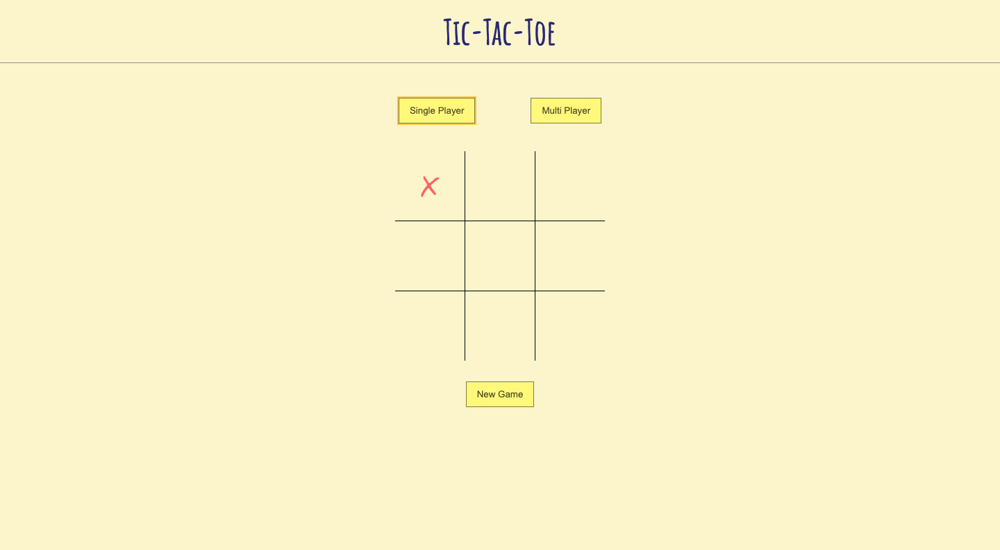

# Tic-Tac-Toe

It is a game in which two players seek in alternate turns to complete a row, a column, or a diagonal with either three O's or three X's drawn in the spaces of a grid of nine squares; noughts and crosses.

In this you can play MultiPlayer mode with your freind or SinglePlayer mode with the AI algorithm.

#### Chek it out live -> https://kedar-nadh.github.io/Tic-Tac-Toe/

## Screenshots

